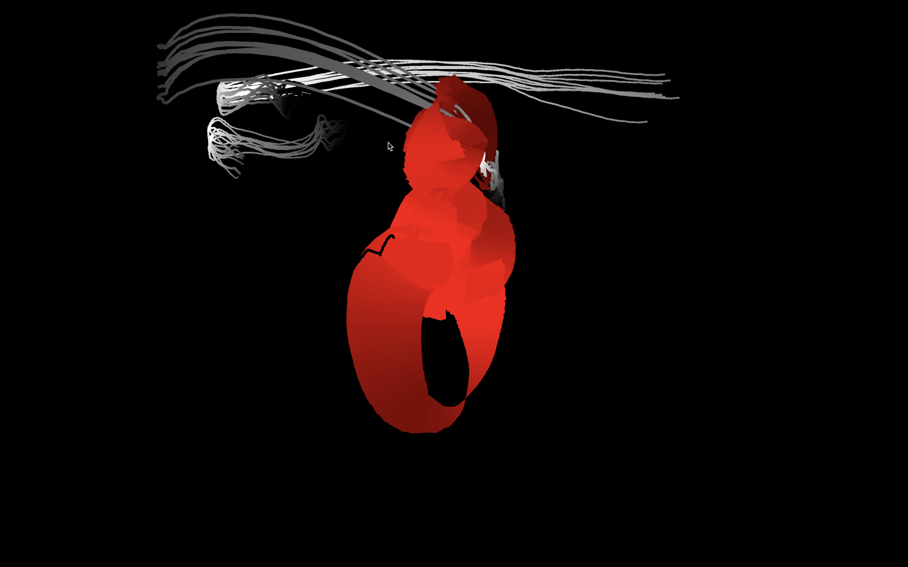
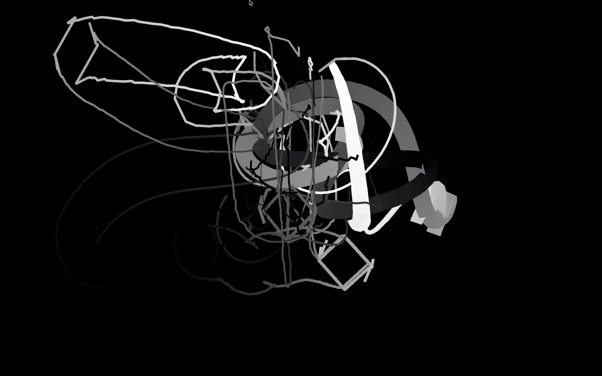
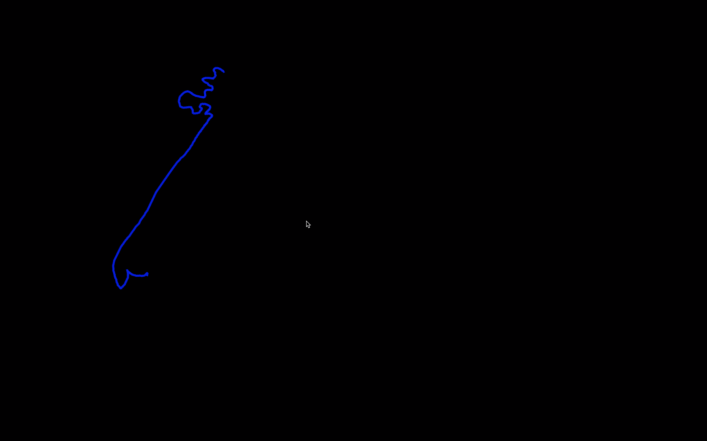
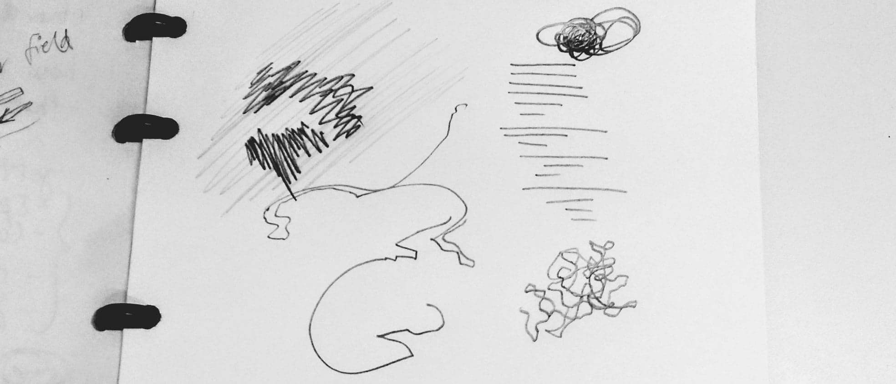

# megafauna
## final presentation
### PRODUCT
**description:** first prototype to create a gestural drawing tool that enables sound composition and behavioral animation.

**design metaphor:** creating a context that needs to be perpetually maintained in order to persist visually and sonically in time.

video performance [here](http://sambourgault.com/megafauna.html).

### CONCEPT AND MOTIVATION
#### why
This is a first attempt to make a performable tool that combines sound and drawing. It puts forward direct manipulation as a way to interact with both components using gestures.

My range of gestural behaviors using the line as a basic unit of composition is represented in the image above. Each of these lines requires a specific gesture to be accomplished. In that sense, the drawing process is deeply **performative**, drawing is in part a choreographic encounter that leaves a trace on a surface. This part of the process is rarely put forward.

#### who

This tool is designed for myself as a first user/performer. Wanting to engage with thorough design practices, this first stage is a playground where I am a [guinea pig](https://upload.wikimedia.org/wikipedia/commons/f/fc/Two_Adult_Guinea_Pigs_%28cropped%29.jpg).

In the future, I would like this tool to be available to other performers but I feel that it requires more work before involving other people. In this case, more work means mainly more flexibility in the creation of sound and brushes.

#### inspirations

Golan Levin's [thesis](https://acg.media.mit.edu/people/golan/thesis/thesis300.pdf): the way Golan Levin worked on his different audio visual tools is extremely methodic. Reading his thesis gave me the intuition to design for sound and visual.

Aim: "bringing two things to bear on the problem space of audiovisual instruments: firstly, flexible technologies, such as real-time audio synthesis, gestural signal analysis, and expressive gestural interfaces; and secondly, a systems aesthetic, which seeks to substantiate such works with an underpinning of perceptual motivation, and infuse such works with a vibrant collaboration between the system’s designer and its performer."

### PROCESS
#### components
Back end: heavily based on object-oriented programming and polymorphism.

Visual unit: the line.
A sound and a behavior is associated with each line.

Sound units:
- sampler
- additive synthesis
- fm synthesis
- am synthesis (line, adsr)

#### evolution
Identification of the potential gestural parameters
- length of the line
- pressure of the pencil
- curvature of the line
- speed of the drawing process

Sound features to map
- frequency and amplitude
- playback speed
- repetition rhythm
- envelope parameters
- filtering parameters

Basic Behaviors
- queue (FIFO)
- stack (FILO)
- disappearance through alpha
- rotation around axis

Aesthetic of lines
- single lines
- multilines
- varying stroke weight
- varying colors

My set of line instruments is therefore a test of intrinsic relationships between gesture/sound/behavior/aesthetic.

#### challenges
- creating tight connections between gestures, lines and sound: what to map to what? does everything needs to be meaningful or can it be simply aesthetic?
    - methodology to approach the problem: a sound to a line.
    -
- finding a coherent aesthetic.
    - removing inessential visual feature.

#### learning / observations

- Visual composition guides my interaction with the tool. I see the lines cohabiting in this environments in symbiosis.
- Direct manipulation versus line analysis.
- The way I built the system is still not optimize for easy prototyping. The next iteration should be made more modular in order to link gestures to line behaviors, aesthetic and sounds quickly, maybe in a plug-and-play fashion.
- I want control on my sound so it's hard to plan good variations.
